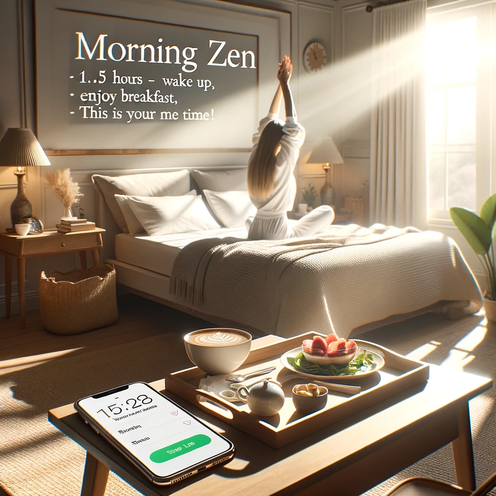

Ever feel like there aren't enough hours in the day? Between juggling work, making sure you're eating something healthier than instant noodles, keeping up with your social life, and trying to remember if you fed the cat, life can get overwhelming! But what if I told you there's a technique that can help you squeeze more juice out of your day? Well, keep reading, because I've got a game-changer for you!

**The Problem:** We all know the drill. Work for 8 hours, then remember you have to do sports, write to friends, cook (and not just microwaving!), clean the house, read, socialize, and... well, live life! Plus, there's the time spent preparing for the day and commuting. Phew! Makes you tired just thinking about it, right?

**The Solution:** I have created this simple yet effective schedule to get the most out of your day, leaving you feeling accomplished and mentally refreshed:

- At home:
    - **1.5 hours**. For you and your family, to get ready inside and out.

- At work:
    - **5 hours**. Work of the day. Your One Thing. No distractions whatsoever.

    - **3 hours.** Your other priorities (emails, administrative tasks, meetings... )

- Preparation for the next day. Write down the 6 most important things you need to accomplish the next day using: Ivy List

More in detail we have:

1. **Morning Zen (1.5 hours):** Wake up, stretch a bit, and enjoy a leisurely breakfast. This time is all about you, so avoid the temptation of checking notifications or getting caught up in the latest Twitter drama. Remember, this is your "me time", so make the most of it!

2. **Focused Work (5 hours):** Dive into your main task for the day, your "One Big Thing". No distractions allowed! Put on some concentration music, maybe some whale sounds if that's your jam and get to work.

3. **Other Priorities (3 hours):** This is your time to tackle other tasks on your list. And guess what? This, combined with your focused work, gets you to that 8-hour workday.

4. **Plan Ahead:** Before calling it a day, jot down the top 6 tasks for tomorrow. I recommend the Ivy List (check out this [cool infographic](https://i.pinimg.com/736x/9f/31/b8/9f31b86a51b3dbfe438379187b4fae5c.jpg)). It's like giving your future self a little gift!

**The Golden Rules:**

1. **Stay Distraction-Free:** During your focused work time, keep distractions at bay. It's easy to get sidetracked by a cute cat video or an email about a sale on socks. But remember, this is your time to shine. Save the cat videos for later; they'll still be cute!

3. **Keep Your To-Do List Tidy:** Whether you're a digital native using fancy apps or old-school with a trusty notebook, keep your tasks organized and prioritized. Imagine your to-do list is like your wardrobe. You wouldn't want to rummage through a pile of clothes every morning, would you?

In a nutshell, this method emphasizes managing our time wisely and efficiently. So, give it a shot and transform your day into a productivity powerhouse!
