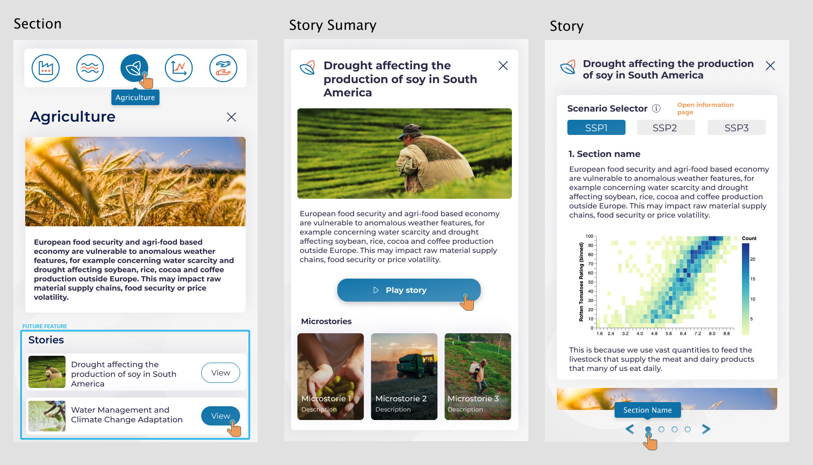
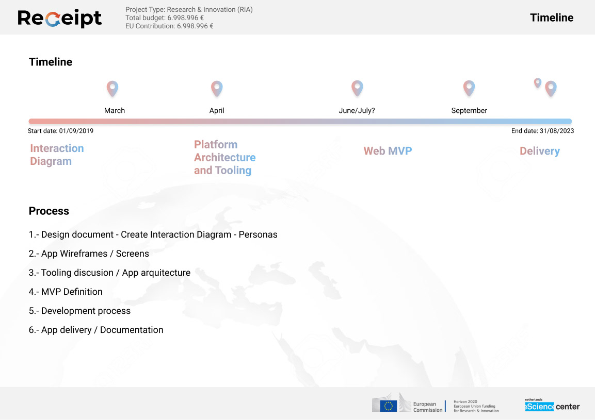

The "Climate Storylines" website is a platform dedicated to sharing insights on climate change through various narrative approaches. It features storylines crafted to elucidate the impacts and challenges associated with climate change in a relatable manner. The site also provides resources and a network for dialogue and engagement among stakeholders. Through its unique storytelling approach, it aims to foster a deeper understanding and prompt action towards a more sustainable and resilient future.

I developed the UI from scratch, being sure that the user experience between scenes was working perfectly.

Technology Stack

