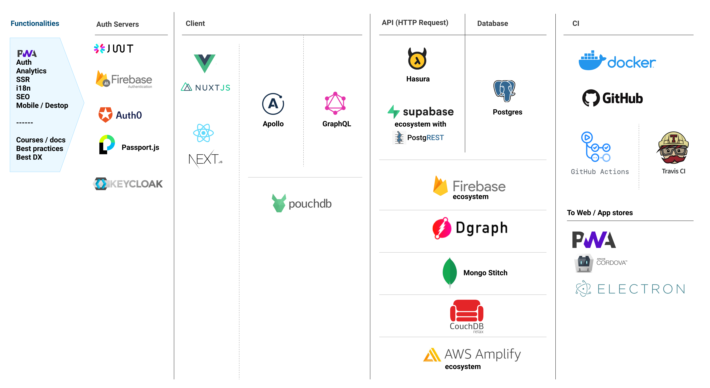
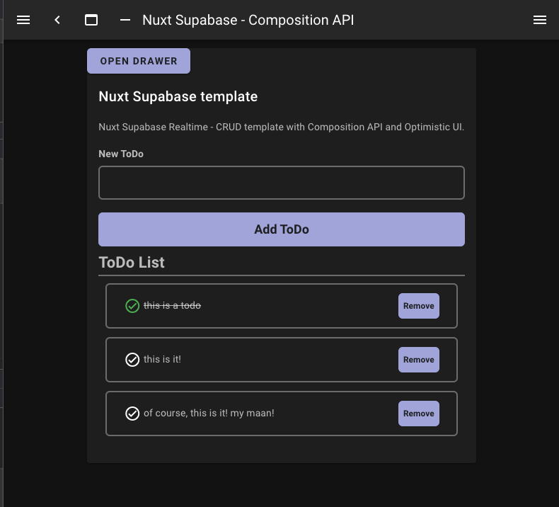

I built a Nuxt-supabase ready-to-use template and I wanted to write a postmortem about what I have learned in making this repository recipe.

You can see the code here: [https://github.com/ctwhome/nuxt-supabase](https://github.com/ctwhome/nuxt-supabase)

In the first place, I am getting very excited about the idea of using Supabase. After a few years working with Firabse, and attend to build a couple of huge [applications](http://ideasdiamond.com/) with it. I became quite frustrated about optimizing absolutely every single coma of the application to avoid a huge invoice surprise by trying to squeeze all the services I use from firebase: hosting, functions, auth, extensions! from firestore. From all of them, Firestore is the most difficult to master, at least psychologically. If we talk about firebase education, the (famous, entertaining) very educational videos from ‘[Get to know Cloud Firestore](https://www.youtube.com/watch?v=v_hR4K4auoQ&list=PLl-K7zZEsYLluG5MCVEzXAQ7ACZBCuZgZ)’ with [Todd Kerpelman](https://ctwhome.com/undefined), and the firebase documentation itself are awesome, but in the development day-to-day side, struggling with counters, no full-text search, simple queries, and database architecture was hell for me. And the result is that I spent way too much time trying the best practices rather than developing the real thing. I could use Argolia or elastic search, but that only adds more complexity to the equation. I know I shouldn't be afraid, but deeply in my nervous system, I was. And that blocked me a lot.

In general, I want to build a recipe for a full-stack that works, it is completely free, and uses the database as a service (DBaaS?). Better yet: platform as a service (PaaS). See below the map of technologies that I am trying out and creating recipes for [https://github.com/NLeSC/full-stack-recipes](https://github.com/NLeSC/full-stack-recipes)

Then I went all the way with Hasura and created a template like this one: [https://github.com/NLeSC/nuxt-apollo-hasura](https://github.com/NLeSC/nuxt-apollo-hasura). Long story short: creating auth for Hasura and the custom claims it’s very difficult for me. I wanted everything working from a docker-compose, click and run. I tried many solutions with Auth0(that worked but not an option since it is not opensource), Kleycloak, and my own server solution with Passport.js. That worked, but I feel it requires more maintenance than I think. The good thing is that I learned a lot about the two Auths, authentication and Authorization, with JWTs. The rest is just awesome with Hasura.

So trying to find the ‘holy grail’ of full-stack recipes, I had to put my hands down with Supabase and Nuxt. The premises are the same as those for my previous template with Hasura: [https://github.com/NLeSC/nuxt-apollo-hasura](https://github.com/NLeSC/nuxt-apollo-hasura). They share in common the following requirements to have:

- Optimistic UI.

- Auth with federation logins and email magic link.

- Full-text search.

- Real-time subscriptions.

- Basic offline mode.

- Be completely open-source (preferable).

- Run locally with Docker.

Just saying. Nuxt + Supabase complies with all these requierements. Top-notch.

> Nuxt Supabase Recipe: [https://github.com/ctwhome/nuxt-supabase](https://github.com/ctwhome/nuxt-supabase)

In Vue 3 and the new composition API, I thought it was a good thing to consume my weekly holiday from my main job to learn how it works and try it out with Nuxt(2). It worked, and I had the chance to learn better how reactivity works in Vue using the code port ([@vu](http://twitter.com/vuw/composition-api)e[/composition-API](http://twitter.com/vuw/composition-api)) to use it with Vue 2. I was able to “replace” Vuex with the new, less boilerplate composition API. Yes, I will lose the plugins like Vuex/persists. I know. But I didn’t discard Vuex at all; I think they can work beautifully together. I also learned that the calls to external APIs, like accessing the database, it makes not so much sense to keep the data in the local store. The main reason is that the local state doesn’t know the changes that happen in remote, and if you need to fetch the data from the database anyway, why (double) store it in the local state?.

I want to add more features to the template in the future. My next step is to run the whole thing locally, working in harmony with the [Supabase CLI](https://github.com/supabase/cli) the guys are creating. They are incredibly busy with all the things. The CLI lacks the dashboard you can find in the supabase.io cloud, as well as proper documentation. But at the end of the day, Supabase is just 1 year old. Let’s give them a break!

PS: But not too long, guys, because you rock, and we need you!

J.Gonzalez — [@ctwhome](http://twitter.com/ctwhome)
