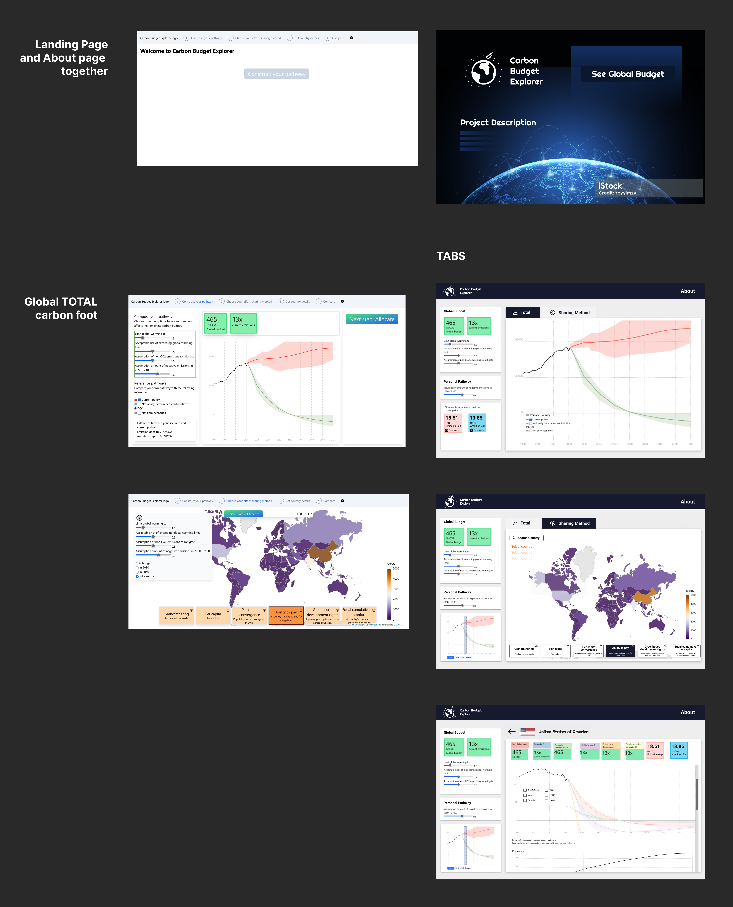

**Role:** UI/UX Designer and Logo Creator
**Objective:** Enhance user experience with a specific focus on policymakers, ensuring clarity and simplicity without compromising on essential data and context.

The Carbon Budget Explorer is an innovative application originally developed by the eScience Center, providing vital insights into the world's carbon footprint. Recognizing the potential to enhance its utility for a broader audience, especially policymakers, I undertook a comprehensive redesign of its interface and branding.

**Design Philosophy:**
At the core of my approach was the belief that data, especially of such critical importance, should be accessible and understandable to all, regardless of their technical prowess. Policymakers, who play a crucial role in shaping global decisions, need tools that speak their language.

* * *

**Challenges and Solutions:**

- **Complexity vs. Simplicity:** The original design, while robust, presented data in a manner that could be overwhelming for non-technical users. My redesign aimed to declutter the interface, introduce more intuitive navigation, and emphasize key metrics without losing any crucial information.

- **Maintaining Context:** Ensuring users didn't lose context was pivotal. I achieved this by retaining essential elements, using clearer legends and labels, and utilizing colors that resonate with the theme of carbon footprints, all while keeping the user's journey in the application seamless.

Before and after the organization:

**Branding:**
Alongside the UI/UX overhaul, the project also warranted a fresh visual identity. I developed a new logotype for the Carbon Budget Explorer, reflecting both its scientific roots and its modern, user-centric approach. The logo, minimalistic yet evocative, complements the application's refined design language.

