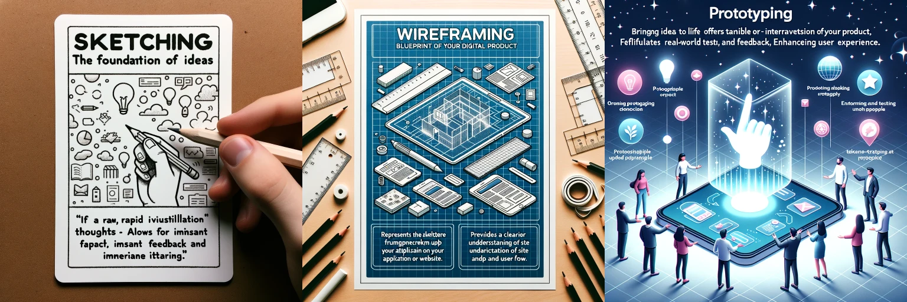
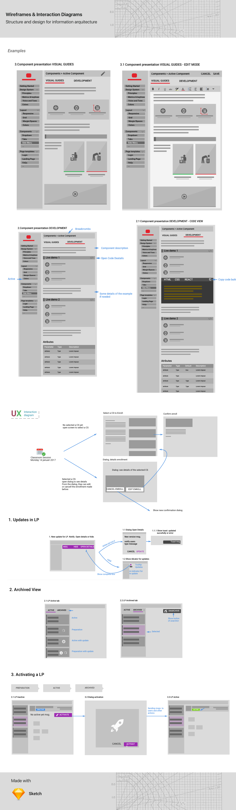

When developing any type of application, and especially those that will involve user interaction, clarity of vision and iterative refinement are key. Here's where **sketching**, **wireframing**, and **prototyping** come to the forefront.

1. **Sketching**: The Foundation of Ideas
    - A raw, rapid visualization of thoughts.

    - Allows for instant feedback and immediate iteration.

2. **Wireframing**: Blueprint of Your Digital Product
    - Represents the skeletal framework of your application or website.

    - Provides a clearer understanding of site functionality and user flow.

3. **Prototyping**: Bringing Ideas to Life
    - Offers a tangible or interactive version of your product.

    - Facilitates real-world testing and feedback, enhancing user experience.

Incorporating these techniques seamlessly aligns with the principles of **Design Thinking**—a methodology that prioritizes empathizing with end-users and encourages iterative design for optimal solutions. It emphasizes understanding the user's needs, defining the problem, ideating solutions, prototyping, and testing.

Furthermore, the essence of the **Kaizen philosophy** lies in continuous improvement. Prototyping embodies this by allowing designers and developers to quickly iterate and refine their products, ensuring constant enhancement and perfection over time.

In conclusion, sketching and wireframing set the stage for effective design, while prototyping brings your vision closer to reality. Together, they form a potent trio that can significantly speed up the product development process, ensuring that the end result is both user-centric and of high quality.

Remember, a well-planned blueprint leads to a successful build. Embrace these tools and watch your digital projects thrive!
