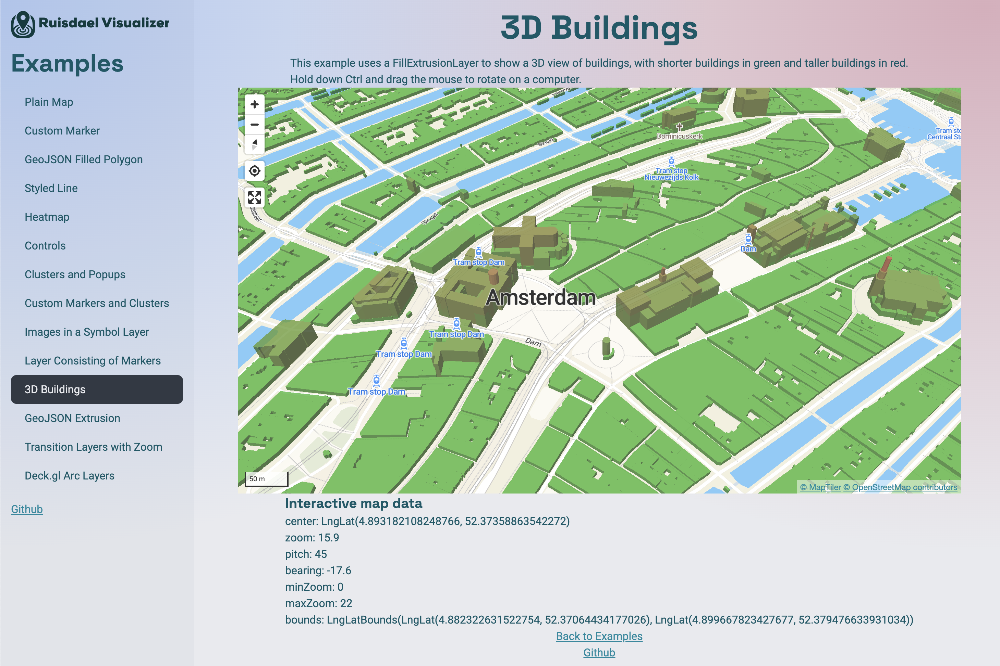

Welcome to the Geospatial Playground, an immersive platform where users can delve into a variety of map and GIS functionalities. From the simplicity of a Plain Map to the complexity of GeoJSON Extrusion and 3D Buildings, this portfolio showcases a range of experiments with custom markers, styled lines, heatmaps, and more.

Access the application →

Engaging with interactive clusters, pop-ups, and transition layers, all enriched with the power of Deck.gl Arc Layers, providing a comprehensive view of the possibilities within modern mapping technologies.

