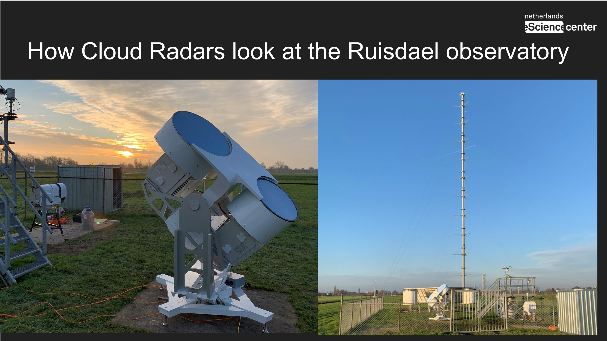

A dynamic 3D volumetric rendering on the Web for large data.

Created in collaboration with the Ruisdael Observatory at the technical university TUDelft (The Netherlands) Jesus Garcia Gonzalez (The Netherlands eScience Center), and Gijsh van den Oord (The Netherlands eScience Center), Louise Nuijens (TU Delft). Fredrik Jansson (TU Delft)

This is a project where we are trying to pull the data from the observatory and treat it with [DALES](https://research-software-directory.org/software/dales) (a model that simulates atmospheric boundary layer physics). Our goal is to create an interactive platform to study the time lapses between different measured cloud points taken by the observatory and processed with DALES.

Measuring the clouds with different instruments (Radars, Anthenas)

## Technical challenges

Rendering the clouds using ThreeJS. Getting the cloud points from a compressed file using [ZarrJS](https://github.com/gzuidhof/zarr.js/) and transforming the data into a

The first implementation of the animation with the clouds following a time line play.

Displaying a Map underneath the clouds:

