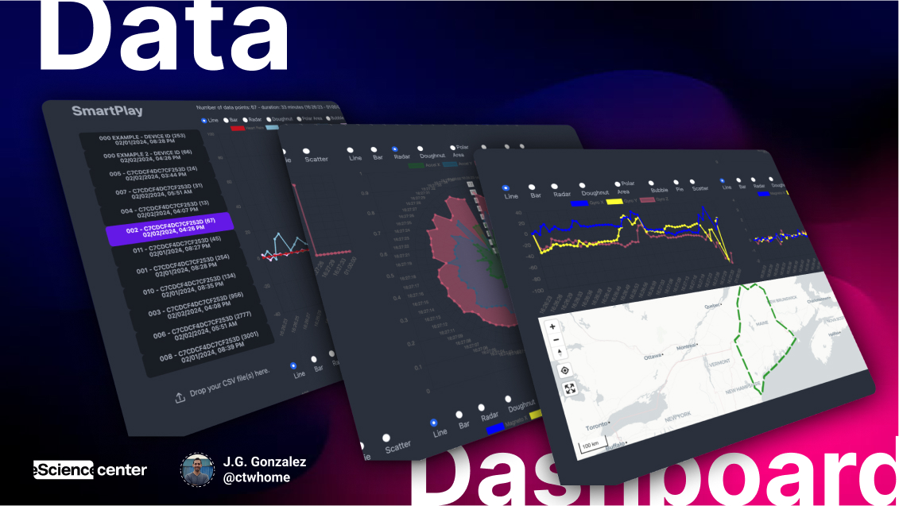
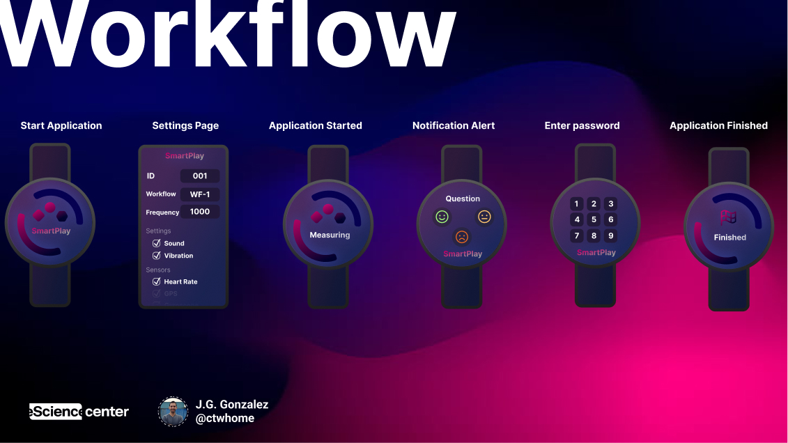
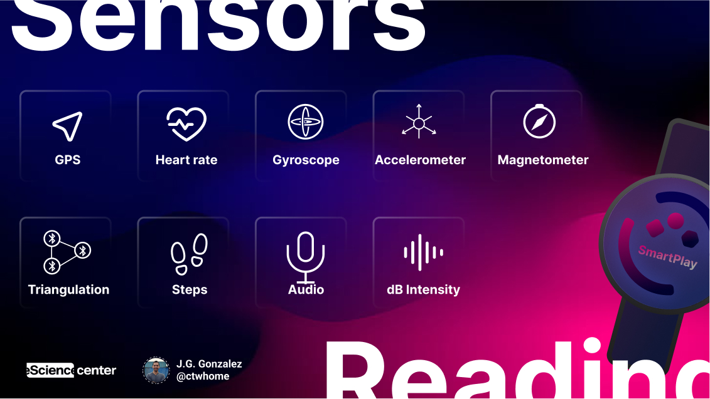
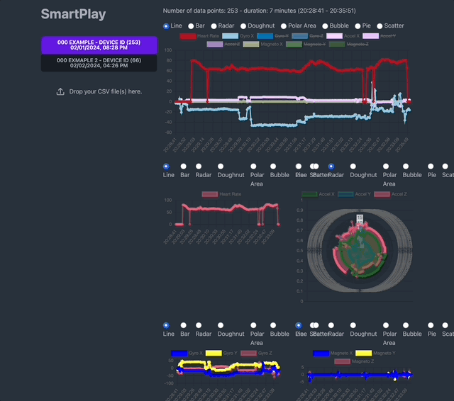

# Bridging Life Sciences and Social Sciences: SmartPlay

**SmartPlay** is an exciting innovation that sits at the intersection of **life sciences** and **social sciences and humanities**. As a WearOS app designed for children, SmartPlay offers a unique way to measure and understand play behaviors by collecting real-time data using advanced wearable technology. In collaboration with developmental psychology and human-media interaction experts, this project stands as a testament to the value of cross-disciplinary approaches to solve complex research challenges.

### A Data-Driven Approach to Understanding Play

Play is a fundamental aspect of child development. However, capturing the nuances of children’s play behavior and understanding its impact on emotional, social, and physical development is a challenge that traditional methods fall short of addressing. SmartPlay steps in to bridge this gap by providing researchers with a rich dataset comprising both **objective sensor data** and **subjective input** from the children themselves.

With its ability to track **geolocation**, **movement**, **heart rate**, and even **environmental audio**, SmartPlay offers a **comprehensive tool for researchers** interested in understanding how children interact with their surroundings during play. This tool is especially powerful for studying how different environments, peer interactions, and physical activities affect children’s emotions and development.

The project is designed with the needs of both **life sciences** and **social sciences and humanities** in mind. The **data-driven aspect** of SmartPlay allows for quantitative analysis, which is essential in the life sciences, while the ability to capture children’s subjective experiences ensures that the richness of individual stories is not lost—a key aspect valued in social sciences and humanities.

### A Cross-Disciplinary Solution

SmartPlay emerged from a collaboration between experts in **developmental psychology**, **human-media interaction**, and **software engineering**. This project underscores the importance of bringing together specialists from **life sciences** and **social sciences and humanities** to develop effective solutions for understanding human behavior.

- **Developmental Psychologists** contribute an understanding of child behavior and the significance of different play contexts.
- **Human-Media Interaction Researchers** focus on designing seamless, glanceable user experiences for children.
- **Software Engineers** ensure that the technology is robust, secure, and capable of collecting and processing high-quality data in real-time.

This cross-disciplinary foundation allows SmartPlay to address **complex, real-world problems**—gathering not only quantitative measurements but also emotional and subjective experiences from children.

### Key Features and Broader Applications

#### **Comprehensive Sensor Integration**
SmartPlay is equipped with sensors that allow it to collect **GPS data**, **Bluetooth triangulation**, **heart rate**, **gyroscope and accelerometer data**, **environmental noise** levels, and more. This diverse set of sensors creates a **holistic picture** of the child’s play environment.

The project also extends beyond its initial developmental psychology focus. **Sports scientists** can use SmartPlay to measure physical activity, **health researchers** can monitor non-medical indicators of well-being, and **elderly care** practitioners can use it for fall detection and reminders—highlighting its versatility across disciplines.

#### **Privacy and Ethical Considerations**
Privacy remains a central pillar of the SmartPlay project. With data stored locally and extracted only via **offline methods**, SmartPlay ensures compliance with ethical standards required in both life sciences and humanities research. This rigorous approach to privacy is crucial when working with children, as it maintains a high level of **data security** and **participant safety**.

### SmartPlay in Action: Empowering Research

The impact of SmartPlay lies not only in its immediate capability to **enhance research quality** but also in its potential to broaden the understanding of how play affects child development. Its interdisciplinary nature means that it is more than a data collection tool—it is an enabler of **cross-domain research** that incorporates physical, psychological, and social dimensions of development.

SmartPlay encourages researchers to move beyond isolated methods of data collection by providing a platform where quantitative and qualitative data converge. This intersectional approach supports a deeper, more nuanced understanding of play behaviors, engagement, and developmental outcomes.

### Contribute and Collaborate
The success of SmartPlay depends on collaboration across disciplines. We invite **researchers, engineers, educators**, and **psychologists** to join us in expanding the impact of this project. Together, we can push the boundaries of what technology, life sciences, and social sciences can achieve.

For more information, check the [user manual](https://github.com/ctwhome/SmartPlay/blob/main/INSTALL.md), try the app by [downloading the APK](https://github.com/ctwhome/SmartPlay/blob/main/releases), or visualize the data through our [online dashboard](https://ctwhome.github.io/SmartPlay).

**SmartPlay** is a prime example of how **technology** can be developed with a **purposeful design** that is accessible, ethical, and impactful across domains. It not only serves life sciences with its quantitative data collection but also caters to social sciences and humanities by maintaining the depth of human experience—bringing together the best of both worlds.
