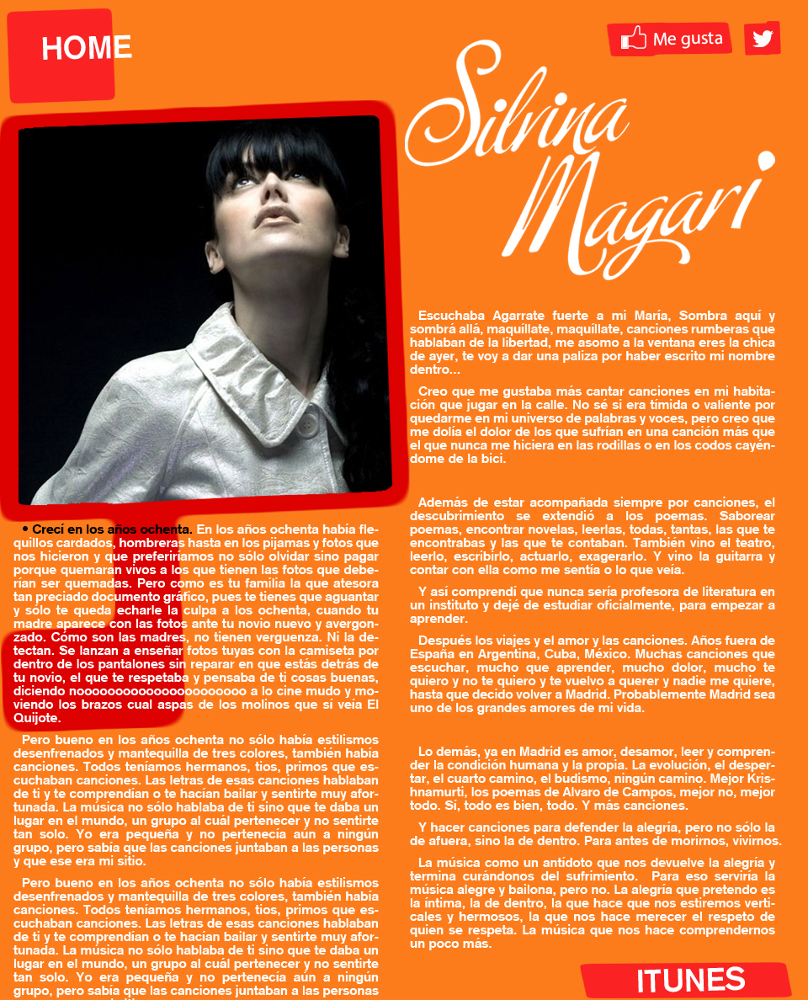

Embarked on a project to design and implement a digital marketplace promoting the album of the talented singer Silvina Magari. The platform serves as a nexus between the artist and her audience, offering a seamless interface to explore and purchase her music. Employing a minimalist yet engaging design aesthetic, the marketplace exudes a musical ambiance that resonates with Silvina's artistic persona. The back-end implementation ensured a secure, robust, and user-friendly platform, enhancing the user experience while facilitating smooth transactidons. This project not only bolstered Silvina Magari's online presence but also created a dedicated space where fans can connect with her music and support her artistic journey.

<!--  -->

