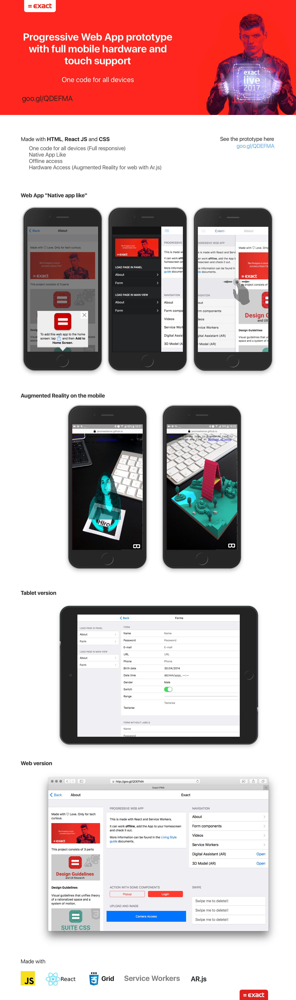

In 2017, I introduced a groundbreaking prototype to our company – an avant-garde Progressive Web App (PWA) that capitalized on the full might of the technology, freshly introduced back then. A masterful blend of cutting-edge tech and responsive design, this prototype served as a beacon, showcasing the enormous potential of PWAs.

**Key Highlights**:

- **Unified Codebase**: Developed using HTML, ReactJS, and CSS, ensuring a singular code for all devices.

- **Augmented Reality Capabilities**: Leveraging AR.js, the prototype offers augmented reality experiences on mobile devices – a rarity at the time!

- **Full Hardware & Touch Support**: Ensures a native app-like feel, giving users an immersive experience.

- **Offline Access**: Service Workers are seamlessly integrated, guaranteeing offline access and performance.

- **Full Mobile & Web Adaptability**: From sleek mobile versions to expansive web and tablet displays, this PWA looks and functions flawlessly across all devices.

The buzz was real! The prototype not only wowed our team technologically but also won hearts with its stunning aesthetics. As a vanguard in the PWA realm, I brought not just a tech marvel to the table, but a visually captivating one at that.

