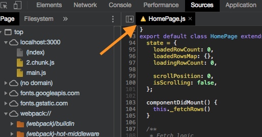

> This blogpost was written in 2018! it has rained a lot since then, especially in the JavasScript world. If might be helpful for you if you are still using Webpack, but hint you should move to Vite as soon as you can.
>
> 2023 Update

I find it essential to be able to edit the code directly from the DevTools when debugging a javascript application. When Chrome added this feature to DevTools it was mind-blowing ✋.

But suddenly, it stopped working with newer versions of Chrome (after v.64) for unknown reasons to me.


After trying to research the whole internet and trying to understand. Finally, the definite solution was shared by [RyanAtViceSoftware](https://github.com/webpack/webpack/issues/6400) in Github. Let’s get directly into the problem without losing focus on fixing the problem.

**You need to be sure you are using 2 things after adding the folder of your project to the workspace:**

- use “\***module-**\*\*” in devtool option in webpack.conf.js, _e.g: devtool: ‘cheap-module-source-map’_

- Add “_**devtoolModuleFilenameTemplate**_” option to your output option in webpack.conf.js as well

For Mac machines:
<!--
```
output: {
  ...
  devtoolModuleFilenameTemplate: info =>
    'file://' + path.*resolve*(info.absoluteResourcePath).replace(/\\/g, '/'),

``` -->

For windows machines (three back bars — ///)

<!-- ```
output: {
  ...
  devtoolModuleFilenameTemplate: info =>
    'file:///' + path.*resolve*(info.absoluteResourcePath).replace(/\\/g, '/'),

``` -->

After rerunning your Webpack application, the maps should be now working.



I hope this solved the problem for you as well 💛
