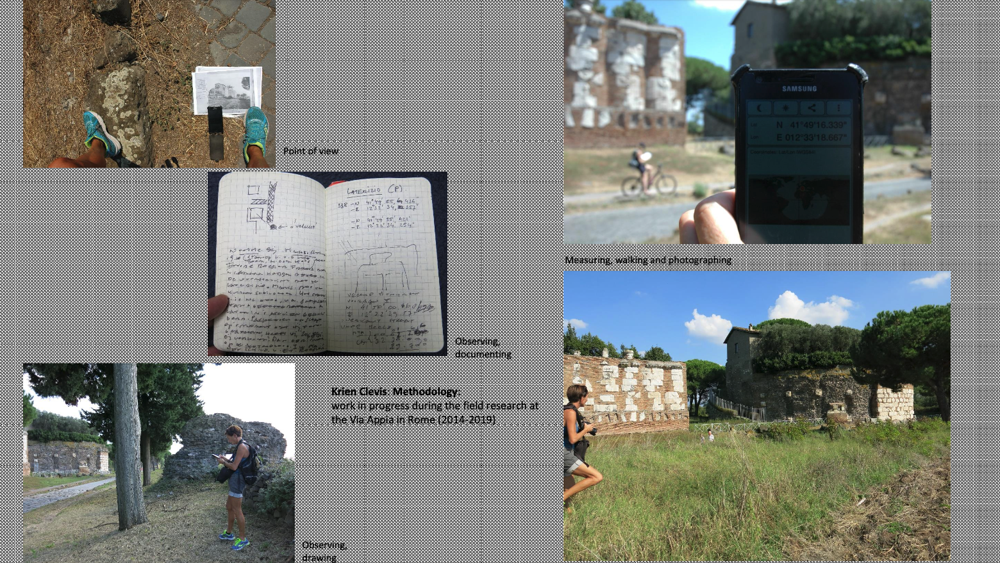

The eternal road that defined the past, present, and future of the science center. If we look for a project that has been a historical experience and opportunity at the eScience center, it can only be one.

  <a href="https://via-appia.netlify.app/" target="_blank" class="btn  !btn-primary !no-underline">Open experience here</a>
  <a href="https://revisited-via-appia.nl/en/" target="_blank" class="btn btn-ghost !no-underline">Project website</a>

### Revisiting the Via Appia: How We Built Interactive 3D Mapping Images and Video Inside a Large Point Cloud for the Web

<video src="./images/intro.mp4" controls title="Title" class="w-full" autoplay></video>

The Via Appia Online Viewer (2022) is a follow-up to the project ["A 3D spatial data infrastructure for Mapping the Via Appia"](https://www.sciencedirect.com/science/article/abs/pii/S221205481630008X?via%3Dihub#!), which is an interactive journey through time along the Roman Appian Way, one of the world's oldest roads. The project called REVISITED Via Appia will be presented at the **het Valkhof Museum in Nijmegen (The Netherlands,** [**link to the exposition memo**](https://www.museumhetvalkhof.nl/zien-en-doen/tentoonstellingen/revisited-via-appia/)**)** with a gamified online version accessible to everyone.

The exhibition connects the results of years of academic and artistic research and offers a refreshing perspective on the 'Regina Viarum' (queen of the roads), allowing visitors to follow in the footsteps of the millions of people who have walked there since Roman times and see how the road has changed over time.

Over the years, researcher Dr. Krien Clevis has collected multiple photos and artworks around the Via Appia road and has taken new photographs for each one, matching the same point of view. The outstanding result when comparing old pictures with the new photographs reveals how time has passed through the main monuments of the road. Dr. Clevis meticulously collected the coordinates of every point of view and matched the original artwork with the new photographs.



## FAIR Storytelling on an online 3D environment
At [The Netherlands eScience Center](https://www.esciencecenter.nl/), we focus on and promote [FAIR software](https://fair-software.nl/). To make the application accessible and reusable, we built the interactive environment using web technologies, a procedure that brings the full immersive experience to online spectators beyond the walls of the museum, accessible on their desktops, tablets, and mobiles.

[](https://lh3.googleusercontent.com/XXGkKmaWcYKsGsLEKJfOc6Ifr4hLNCOWbqm9FWC-KKWDlMdYBDDkWYLnXd9PBu2L-vpqmpacC7su-n35DzDFxquX-y4kIKpmA6PFiwgH6qe0g-tqHGb0QTmahrRyHNKZNBqsnQ8Cf5k)


### Technology stack

We storage out point cloud data under Google Cloud Storage, [PotreeJS](https://github.com/potree/potree/) library to render the PointCloud into the 3D viewer that uses the framework [ThreeJS](https://threejs.org/) built on top of WebGL.

To display the user interface and track the interactions we use [NuxtJS](https://nuxtjs.org/), a [VueJS](https://vuejs.org/) framework as a base, with [TailwindCSS](https://tailwindcss.com/) and themed with [DaisyUI](https://daisyui.com/). This set up allow us to build only one source of code and make it run in different environments (museo application and online web viewer).


### Technology Challenges
Building such an application involves many parts that need to be consider. Some of the features that we I am proud of are the following:

- Fitting the big point cloud into the web converting bit LAS files into LAZ format
- Embedding video textures in 3D space, fully operable with media controls, position and opacity switchers.

[](https://lh6.googleusercontent.com/DdksmnXyVSGB8fpkTFa1t9wv16yENwSXFQ2Dj_CWFTz4mBzlklfs70VfbvpK1f3q13-2eHbBl_dTGgDmvlsJUIFQgCSGYcxw0fGpTYj0x55r3W_uPVayZLqfB0yNq5t1L50frLuNjqU)

- Apply video transparency in the scene:
[](https://lh3.googleusercontent.com/FUhBh0MfgliC6I7vyM9C3c0MM8nk5fW3wcYac1ZiOd-yCWNHhNPUGRMFXROSUsRQXnmkqkw_jzeC-p5wo4NIlxye3qK2rNdHGTVqKNcZms7w2SuNcLimDfrE8dFUb0ystecKWjdnX4c)

- Making the image match the screen size involves a more complex process, considering a few factors: the screen size is responsive, and we don't know the precise size of the user's window, monitor, or tablet. Positioning media elements in 3D space is not a difficult task thanks to ThreeJS, but placing the camera in front of the video and matching the field of view requires finding the correct trigonometric calculations to maintain the scale of the image and the distance to the camera.

```
if (selectedVideo && isFollowCamera) {
    const aspectRatio = 9 / 16; // Aspect Ratio 16:9
    const keep = 6.37 * this.scaleMedia;
    const scale = keep * Math.tan(fov / 2.0 * Math.PI / 180.0) * 2.0;
    potreeRef.selectedVideo.scale.set(
        1 * scale,
        aspectRatio * scale,
        1 * scale
    );
}
```


[](https://lh3.googleusercontent.com/VBRUuntKZbgpJn31F4f477jVBtAtAB65g8h36X4LsQ1vSiBlnCsU_ed-SmtXaH7ojnBAAQwKG7igR2Wzp0kZzPhTLfPLIBAXEFRiryezZTIXs1VtpoKFVa6mF9ao4piFRjN1i7XbBLY)


### Navigating between story pages

The application has a particular time sequence that occurs every time a viewpoint is selected. In the application, there are:

## Creating the story pages and referencing the 3D viewpoints in the space

Placing the images and navigating through the scene while mapping images with the video:


### **Git-Based Content Management System**

Dynamic point views, or story pages, created with simple markdown files and frontmatter for easy content management.


Every monument will need its own `camera-path-animations.json` file.

Look at the image that represents the idea. Also, find the attached example JSON.


At the museum, you will find all kinds of goodies in the exposition, including personal guides from the principal researcher, restoration representation in 3D.


This project has been made possible thanks to Dr. Krien Clevis, the principal investigator and artist, GIS expert and Research Associate Dr. Maurice de Kleijn (VU), 3D artist and developer Jorne Jongsma, researcher Rens de Hond (VU), artist and archaeologist Marco Roling, archaeology student assistant Stefan Osstingh, Maarten van Meersbergen, and myself, Jesus Garcia Gonzalez, as a research engineer and developer (eScience Center).


### Find the project repository in GitHub here:

https://github.com/Via-Appia/via-appia-online-viewer
