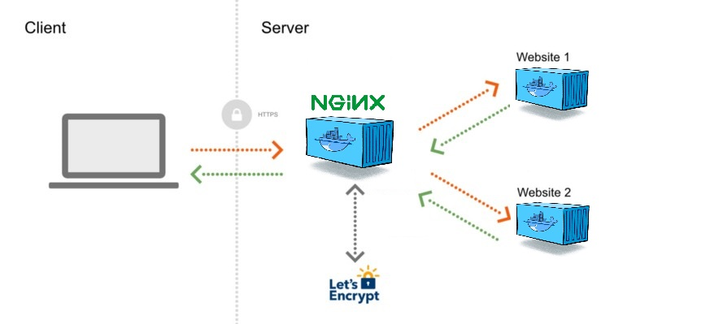

Configuration for home server with reverse proxy and docker-compose

Github Repo:

### Installation

Docker and docker compose must be installed and running.

The configuration needed for the Nginx comes as default inside the reverse-proxy image "jwilder/nginx-proxy:alpine"

[](https://user-images.githubusercontent.com/4195550/194275504-265b194e-9426-4f81-bafc-1a69b2294450.png)

Main docker compose at the root:

```
# IMPORTANT
# First time to run the network has to be created to be able to access to it from the child docker-compose

version: '3' # Version of the Docker Compose file format
services:

  nginx-proxy:
    image: jwilder/nginx-proxy:alpine
    container_name: nginx-proxy
    restart: "always" # Always restart container
    ports:
      - "80:80" # Port mappings in format host:container
      - "443:443"
    networks:
      - network # Name of the etwork these two containers will share
    labels:
      - "com.github.jrcs.letsencrypt_nginx_proxy_companion.nginx_proxy" # Label needed for Let's Encrypt companion container
    volumes:
      # Volumes needed for container to configure proixes and access certificates genereated by Let's Encrypt companion container
      - /var/run/docker.sock:/tmp/docker.sock:ro
      - "nginx-conf:/etc/nginx/conf.d"
      - "nginx-vhost:/etc/nginx/vhost.d"
      - "html:/usr/share/nginx/html"
      - "certs:/etc/nginx/certs:ro"

  letsencrypt-nginx-proxy-companion:
    image: jrcs/letsencrypt-nginx-proxy-companion
    restart: always
    container_name: nginx-proxy-companion
    volumes:
      - "/var/run/docker.sock:/var/run/docker.sock:ro"
      - "nginx-conf:/etc/nginx/conf.d"
      - "nginx-vhost:/etc/nginx/vhost.d"
      - "html:/usr/share/nginx/html"
      - "certs:/etc/nginx/certs:rw"
    depends_on:
      # Make sure we start nginx proxy container first
      - nginx-proxy

networks:
  network:
    # Name of our shared network that containers will use

volumes:
  # Names of volumes that out containers will share. Those will persist on docker's host machine.
  nginx-conf:
  nginx-vhost:
  html:
  certs:
```

### Adding new services to the host

It is important for the reverse-proxy `pass VIRTUAL_HOST and LETSENCRYPT_HOST`

```
environment:
      - VIRTUAL_HOST=domain.com # Enviroment variable needed for proxy
      - LETSENCRYPT_HOST=domain.com # Enviroment variables needed for Let's Encrypt companion
      - LETSENCRYPT_EMAIL=ctw@ctwhome.com
```

Connecting to the main network, docker adds different prefixes to the network depending on how the folder was named.

```
networks:
  nginx-proxy_network:    # Name of our shared network that containers will use
    external: true
```

Increasing the size limit for nginex\_proxy upload size follow this [nginx-proxy/nginx-proxy#690 (comment)](https://github.com/nginx-proxy/nginx-proxy/issues/690#issuecomment-1405169132)
