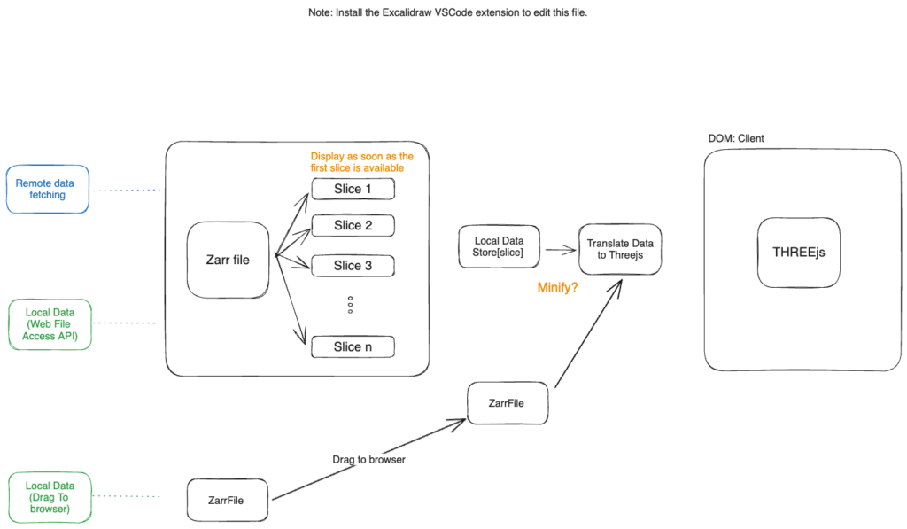
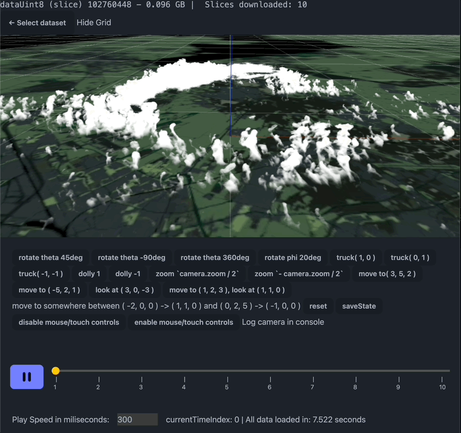
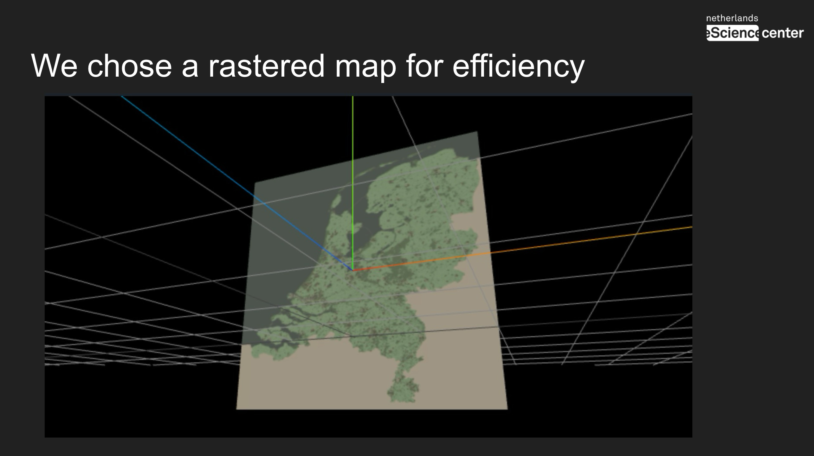

A dynamic 3D volumetric rendering on the web for large data.

Created in collaboration with the Ruisdael Observatory at the Technical University TU Delft (The Netherlands), Jesús Garcia Gonzalez (The Netherlands eScience Center), Gijsh van den Oord (The Netherlands eScience Center), Louise Nuijens (TU Delft), and Fredrik Jansson (TU Delft).

This is a project where we are trying to pull data from the observatory and process it with [DALES](https://research-software-directory.org/software/dales) (a model that simulates atmospheric boundary layer physics). Our goal is to create an interactive platform to study the time lapses between different measured cloud points taken by the observatory and processed with DALES.

Measuring the clouds with different instruments (radars, antennas).

Github Code: https://github.com/NLeSC/zarrviz
Project Website: https://ruisdael.ctwhome.com 

## Technical challenges

Rendering the clouds using ThreeJS. Getting the cloud points from a compressed file using [ZarrJS](https://github.com/gzuidhof/zarr.js/) and transforming the data into a

The first implementation of the animation with the clouds following a timeline play.

Displaying a map underneath the clouds:

