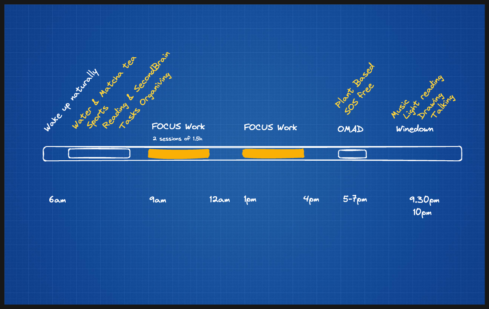
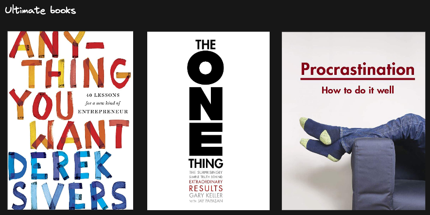

My blueprint consists of several things I've tested and learned about myself over the years. I believe I've reached a significant point.

The priority relies on Peter Attia calling the 4 horses, plus what I consider important for each one of them. All of them have the same priority:

- **Sleep** (8 hours of high quality)
- **Sports** (Strength training and HIIT)
- **Diet** (Plant-based, SOS free)
- **Mental health** (No stress, Relativize, Prioritize the important things, Practice gratitude, Clean up and maintain relations -Marie Kondo for relations-

### What I still need to work on:

- A morning routine.
- A reading corner, outside of my office work desk?
- An evening wind-down routine

Inspiring Books:

## About productivity and well being

